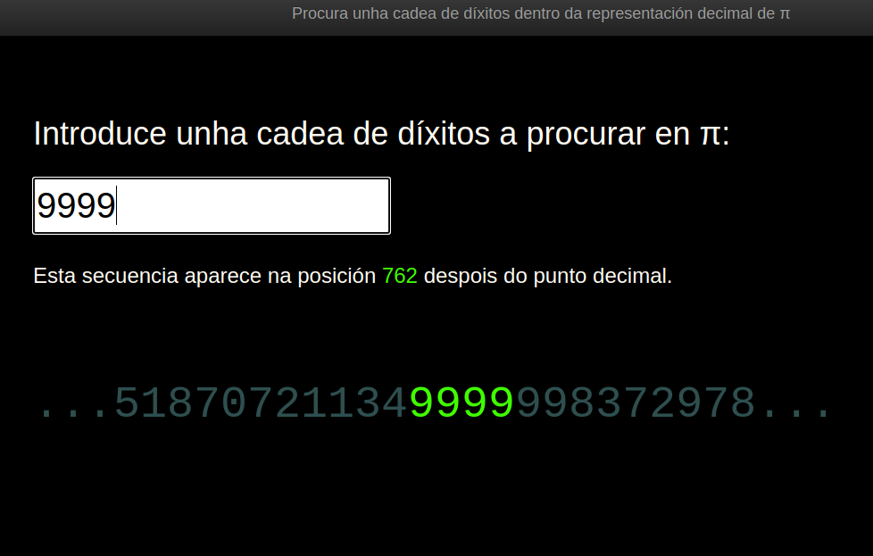

# Searching in decimal sequence of π

[View Project Running Here](https://mvilarinho.github.io/piDigits)

[View Code Here](https://github.com/mvilarinho/piDigits/)

This utility shows if any string occurs in the decimal sequence of π number.

It's inspired these projects:

- Peek in π by the [Team Fathom](http://pi.fathom.info/)
- The Pi Search Page in [angio.net](https://www.angio.net/pi/)
- This [Code Train's Challenge](https://www.youtube.com/watch?v=MEdpRYyjz_0)

